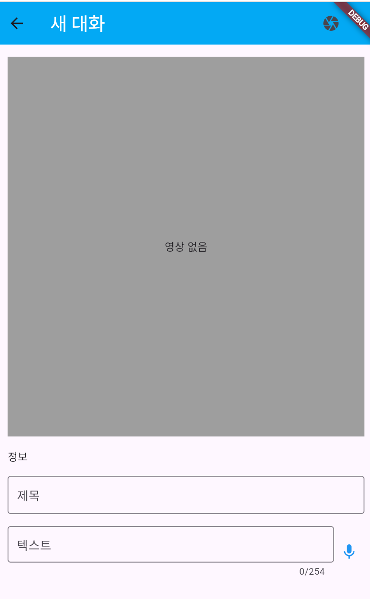

# SUDDY - 수화 번역 어플리케이션

 <!-- 로고 이미지를 여기에 추가하세요 -->

**SUDDY**는 농인과 청인 간의 의사소통을 원활하게 하기 위해 개발된 수화 번역 어플리케이션입니다. SUDDY는 사용자에게 수화를 번역해주는 서비스를 제공하며, 농인들이 더 쉽게 소통할 수 있도록 지원합니다.

## 주요 기능

### 회원가입 및 로그인

- **회원가입**: 사용자는 이메일을 통해 간단한 회원가입 절차를 거쳐 SUDDY를 사용할 수 있습니다.
- **로그인**: 이미 가입된 사용자는 이메일과 비밀번호를 사용하여 로그인할 수 있습니다.

### 스플래시 화면

- 앱 실행 시 로고와 함께 간단한 애니메이션을 통해 SUDDY의 첫 인상을 사용자에게 전달합니다.

### 홈 화면

- **홈 화면**에서는 사용자에게 SUDDY의 주요 기능에 빠르게 접근할 수 있는 UI를 제공합니다.
- 수화 번역, 최근 번역 기록, 즐겨찾기 기능 등을 탐색할 수 있습니다.

### 동영상 재생 화면

- 사용자가 업로드한 동영상이나 실시간으로 촬영한 영상에서 수화를 번역하고, 자막으로 표시합니다.
- 동영상은 사용자가 조작하기 쉽게 재생, 일시 정지, 다시 보기 등의 기능을 포함합니다.

## 스크린샷

### 스플래시 화면


### 회원가입 및 로그인 화면


### 홈 화면


### 동영상 구현


## 설치 방법

1. **클론 저장소**:
   ```bash
   git clone https://github.com/yourusername/suddy.git
   cd suddy
